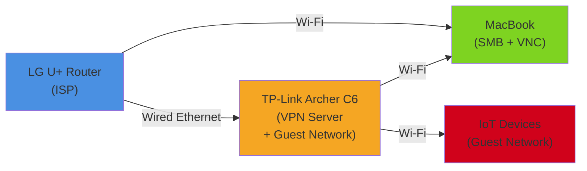
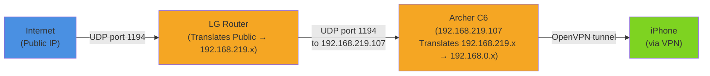

## The IoT Rabbit Hole

Last month I bought a Matter-compatible smart switch. Nothing fancy — just a wall outlet switch that talks to the Matter standard. It arrived, I set it up, and then it hit me: **where is this thing supposed to go on my network?**

I'm a backend developer. I work with servers, databases, APIs. I understand application layer stuff reasonably well. But home network infrastructure? I had no idea. And more importantly, I wasn't comfortable putting an IoT device on the same network as my MacBook without understanding what that meant.

So I started researching. The stories are... not comforting. Smart home devices get compromised. They phone home to random servers. They're often on cheaper hardware with less frequent security updates. If something gets access to my home network through a smart switch, it's on the same network as my work laptop, my files, everything.

That's when I remembered: **I have a TP-Link Archer C6 sitting in a drawer.**

## A Router Saved From Obsolescence

I bought the Archer C6 about two years ago for an apartment I used to live in. The landlord didn't provide Wi-Fi, so I grabbed a cheap but reliable router. When I moved to my current place, the new apartment already had a good connection through LG U+ (the ISP), so the Archer just... disappeared into a drawer. Been there ever since, gathering dust.

But instead of thinking "oh, free router," I thought: **what are the useful things you can actually do with a second router?**

The common options are:
1. **Extender** — boost Wi-Fi signal in a far corner
2. **Wireless bridge** — connect wired devices to Wi-Fi
3. **Switch** — add more wired ports to the network
4. **VPN server** — create a tunnel for remote access

For my apartment (small, Wi-Fi already covers it, everything I own is wireless or built-in), the first three don't apply. But the fourth? That checked two boxes at once.

## Why a VPN Server Makes Sense

**First reason: IoT security.** If I set up a guest network on the Archer, IoT devices go there. My MacBook stays on the main network. A compromised smart switch can't see my laptop's traffic or files. This is basic network segmentation.

**Second reason: learning.** I recently changed jobs. Now I'm working at a company where I'll be dealing more with infrastructure, DevOps, networking concepts that I've avoided thinking about. Building this hands-on felt like the opposite of memorizing definitions. I'd actually understand how packets flow, what port forwarding does, why DDNS matters.

## The Architecture I'm Building

Here's what I planned:

The LG U+ router is the gateway to the internet. The Archer C6 plugs in via ethernet and serves two purposes: it runs a VPN server (so I can access my stuff from outside), and it broadcasts a guest network where IoT devices live in isolation.

My MacBook connects to the Archer's main network. That means from anywhere with internet, I can VPN into the Archer, and then access my MacBook for file sharing and remote control.

## The Networking Problem: Double NAT

This is where it gets interesting. I need to understand **what a double NAT actually is** before I can fix the problems it causes.

**Single NAT:** You have a public IP (one your ISP gives you). Your router sits between the internet and your devices. It translates between the internet's public IP and your devices' private IPs (usually 192.168.1.x). Traffic from outside hits your public IP, and the router forwards it to the right device inside. That's NAT.

**Double NAT:** Now I plug a second router (Archer C6) into the first router (LG U+). The C6 gets a private IP from the LG router — something like 192.168.219.107. When I want VPN traffic to reach the C6 from the internet, the flow looks like this:

Two layers of address translation. That's the "double" part.

**Why it matters for VPN:** The LG U+ router doesn't know to forward incoming VPN traffic to the Archer by default. I need to **explicitly tell it**: "Port 1194 on the public IP? Send that to the Archer at 192.168.219.107."

## What I Actually Need to Do

Three things stand between me and a working VPN:

1. **Port forwarding** on the LG router: Tell it to forward port 1194 (VPN) to the Archer's private IP.

2. **DHCP static binding**: Lock the Archer's IP address so that if it reboots, it still gets 192.168.219.107. If the IP changes, the port forwarding rule breaks.

3. **DDNS** (Dynamic DNS): Here's the catch — I don't have a static public IP. ISPs rotate these. So instead of remembering my IP, I'll use a hostname that automatically updates. Something like `samcho.ddns.provider.com` always points to my current public IP.

Each of these is a small puzzle. None of them are hard, but they all matter together.

## Next

The next post is where the actual hands-on work happens. Setting up DDNS on the Archer, enabling OpenVPN, configuring port forwarding, installing the VPN client on iPhone, and then... hitting a bug that teaches me exactly why double NAT is a pain.

---

| Post | Title |
|---|---|
| → Next | [[en/router-vpn-02\|Part 2: Building the VPN Server]] |
