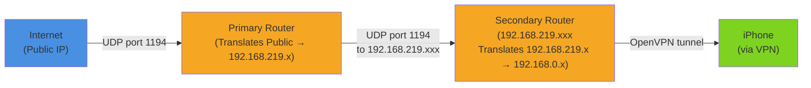

## It Started With a YouTube Video

I came across a Korean YouTube channel called 자취남 (Jachwinam) — a creator who makes content about studio apartment living, including IoT and smart home setups. Watching someone automate their apartment lights in a 25 sqm space made it look accessible. I ordered a Matter-compatible smart switch that evening.

Got it installed, got the lights running on automation. Satisfying. And naturally, my brain jumped to: **what else around here can I do something with?**

That's when I remembered: **I have a spare router sitting in a drawer.**

## The Spare Router

I bought it a couple of years ago for an apartment where the landlord didn't provide Wi-Fi. When I moved here — which came with an ISP router already set up — it went straight into storage. Been there since.

So I asked Gemini: what can you actually do with a spare router?

Four options came up:
1. **Range extender** — boost Wi-Fi signal coverage
2. **Wireless bridge** — connect wired devices wirelessly
3. **Switch** — add more LAN ports
4. **VPN server** — create an encrypted tunnel for remote access

For my apartment (small, already good Wi-Fi coverage, everything's wireless), the first three don't apply. The fourth one caught my attention.

## Why VPN Made Sense

Gemini mentioned something while explaining the VPN option: you could put IoT devices on a guest network through the Archer, isolated from your main devices. Once it was said, I couldn't un-think it. My new smart switch — a relatively cheap device with firmware I don't control — was sitting on the same network as my MacBook. If it got compromised, it'd be on my network.

**IoT security** became reason one.

**Learning** was reason two. I work as a backend engineer, and I knew what VPN was — conceptually. But I'd never actually built one. DHCP? Barely remembered it beyond the name. What actually happens when NAT runs twice? Couldn't have explained it clearly. I recently changed jobs too, and understanding a new company's infrastructure is just part of the job for a backend engineer. Building it hands-on felt like the fastest way to actually understand how these things work, not just what they're called.

## Where the Conversation Led

It started as "let's learn what VPN is." But as the Gemini conversation went on, ideas kept stacking.

VPN means remote access into the home network. Remote access means I could use the MacBook as a file server and remote desktop. And since the Archer is already there, a guest network would isolate IoT devices from the MacBook.

One idea at a time. Here's what that ended up as:

The primary router is the ISP gateway. The secondary router plugs in via ethernet and serves two purposes: it runs a VPN server (so I can access my stuff from outside), and it broadcasts a guest network where IoT devices live in isolation.

My MacBook connects to the secondary router's main network. That means from anywhere with internet, I can VPN in and access my MacBook for file sharing and remote control.

## The Concepts Gemini Walked Me Through

Before any of the configuration made sense, Gemini covered some fundamentals. These kept coming up throughout the build — worth a quick read if you're new to home networking.

**LAN / WAN**
LAN (Local Area Network) is the network inside your home — the private side. WAN (Wide Area Network) is the internet — the public side. Your router sits at the boundary. Devices on your LAN talk to each other directly; anything going to the outside world passes through the router.

**Public IP vs Private IP**
Your ISP assigns your home one public IP — a globally unique address visible on the internet. Inside your router, devices get private IPs: addresses like `192.168.x.x` that only exist within your local network. My MacBook's IP is `192.168.0.107`, but that address means nothing to the internet. Traffic has to pass through the router to get anywhere.

**MAC Address**
A MAC address is a hardware identifier burned into a network interface (your Wi-Fi chip, Ethernet port, etc.). Unlike IP addresses, which change based on which network you're on, MAC addresses stay with the device. DHCP reservations use MAC addresses as the key: "always give this MAC this IP."

**DHCP**
DHCP is the protocol your router uses to automatically assign IP addresses to devices when they connect. Convenient, but the assigned IP can change on reconnect. For anything acting as a server, you need a fixed address — which is what DHCP address reservation is for.

**NAT**
NAT (Network Address Translation) is how your router lets multiple devices share one public IP. Outgoing traffic gets translated from private IP to public IP; incoming responses get translated back. The problem: NAT is a one-way door. External traffic can't reach inside devices unless you explicitly open a path — which is what port forwarding does.

**Port Forwarding**
A port forwarding rule tells the router: "any traffic arriving on this port, send it to this internal device." For a VPN server, that's "UDP port 1194 → the Archer C6." Without this, all incoming VPN traffic hits the router's NAT wall and gets silently dropped.

**DDNS**
ISPs rotate your public IP periodically — sometimes daily. DDNS (Dynamic DNS) keeps a domain name pointed at your current public IP regardless of changes. Register something like `foobar.tplinkdns.com`, and TP-Link's service automatically updates the DNS record whenever your IP changes. Now you always have a stable address to connect to.

**VPN**
VPN (Virtual Private Network) creates an encrypted tunnel between an external device and your home network. Once connected, the external device behaves as if it's on your LAN — it can reach local services directly. Connect your iPhone to the VPN from a coffee shop, and your MacBook looks like it's right next to you.

---

With those in place, the design makes sense. One thing I hadn't considered before Gemini pointed it out:

## The Networking Problem: Double NAT

When I told Gemini I already had an ISP router at home, it flagged the double NAT situation right away. Obvious in hindsight, but not something I'd thought of on my own.

One router, one NAT. Two routers stacked — the secondary plugged into the primary — and NAT happens twice. The secondary router gets a private IP from the primary (192.168.219.xxx), and VPN traffic needs to navigate both layers to reach it:

The primary router doesn't forward incoming VPN traffic by default — that requires explicit **port forwarding**. The forwarding rule needs a fixed target, so the secondary router's IP must be locked via **DHCP static binding**. And since ISPs rotate public IPs, I need a **DDNS** hostname that always points to the current public address.

Three things. Next post is where I actually build them — including one bug that makes the double NAT problem very concrete.
