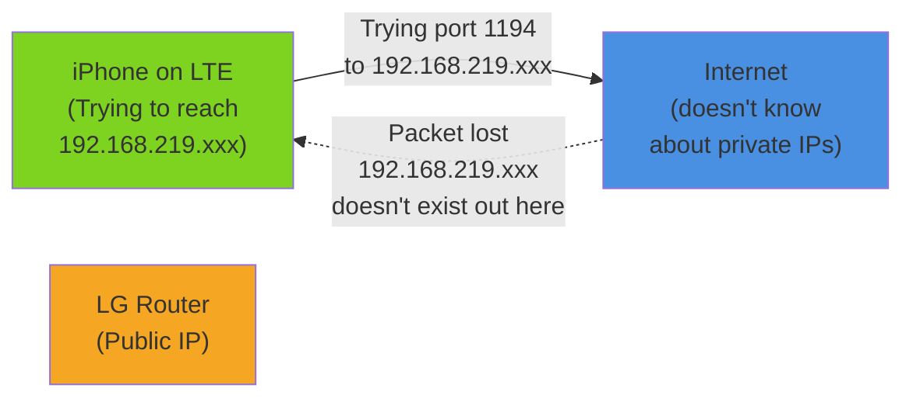

## DDNS First

DDNS before OpenVPN — because the hostname ends up inside the `.ovpn` config file, and I'd rather not regenerate it later.

**On the Archer C6:** Advanced → Network → Dynamic DNS → TP-Link → log in → pick a name → get `[name].tplinkdns.com`.

## OpenVPN Server: Generate, Configure, Export

Still on the Archer C6:

1. VPN Server → OpenVPN Server
2. Enable OpenVPN Server
3. Service Port: leave at 1194 (UDP)
4. Generate certificate and key (the router handles this)
5. Export the `.ovpn` configuration file

The exported file is what I'll install on my iPhone. It contains the certificate, the server address, port — everything the client needs to know.

One setting worth noting: **Client Access** has two modes. "Home Network Only" routes only local network traffic through the VPN — general internet traffic still goes out directly over LTE/Wi-Fi. "Internet and Home Network" sends all traffic through your home connection.

I chose the second option for two reasons: I wanted public Wi-Fi traffic encrypted (coffee shop networks are easy to sniff)[^1], and I wanted Korean Netflix access when abroad. (I'm watching 나는솔로 — not negotiable.)

## Port Forwarding on the LG U+ Router

This is the gatekeeping step. The LG router is blocking inbound connections by default. I need to tell it: "UDP traffic on port 1194? Send it to the Archer."

But first, I need to know what IP the Archer actually has. The Archer itself shows a different IP internally (192.168.0.1, where devices on the Archer network see it). The "WAN" IP is what it looks like from the LG router's perspective.

**On the Archer:** System Tools → System Settings → WAN IP shows `192.168.219.xxx`.

**On the LG U+ router:** NAT/Port Forwarding → Port Forwarding
- External Port: 1194 (UDP)
- Internal IP: 192.168.219.xxx
- Internal Port: 1194
- Enable: Yes

Now any UDP packet hitting port 1194 on the public internet will be forwarded to the Archer.

## DHCP Static Binding

If the Archer reboots and gets assigned a different IP — say, 192.168.219.108 — the port forwarding rule still points to 192.168.219.xxx and traffic disappears.

**On the LG router:** Network → DHCP → Address Reservation
- Device: Archer C6 (its MAC address)
- IP Address: 192.168.219.xxx (lock it in)

Now the Archer will always get the same IP from the LG router, and port forwarding stays valid across reboots.

## The First Test: iPhone + LTE

I installed OpenVPN Connect on my iPhone and imported the `.ovpn` file. This is the critical part: **I have to test on LTE or 5G, not home Wi-Fi.** If I'm on home Wi-Fi, I'm already on the network — VPN won't tell me if the configuration is right. I need to be on a completely different network to know if the traffic actually reaches the Archer.

Connected on LTE. Opened OpenVPN Connect. Hit connect.

**Connection Timeout.**

## The Bug: Private IP in the Config

I pasted the `.ovpn` file contents into Gemini. The diagnosis came back immediately.

```
remote 192.168.219.xxx 1194 udp
```

There it is. The `remote` line is pointing to a **private IP address**. That's the bug.

The Archer wrote its own WAN IP as the remote address — which is 192.168.219.xxx, a private IP that only exists inside the LG router's network. The Archer has no way to know its actual public IP. Classic double NAT problem.



The fix is simple: **edit the `remote` line to use the DDNS hostname.**

```
remote foobar.tplinkdns.com 1194 udp
```

Now when the iPhone connects:
1. Resolve `foobar.tplinkdns.com` → your current public IP
2. Send UDP 1194 to that public IP
3. LG router sees port 1194 on its public IP → forwards to 192.168.219.xxx (Archer)
4. Archer receives the connection → tunnel established

I re-imported the modified `.ovpn` file on iPhone. Connected again.

**Connected.** The tunnel was live.

## Guest Network: Isolation Without Interaction

Now that VPN is working, I need a place for IoT devices to live without being able to touch my MacBook traffic.

**On the Archer:** Wireless → Guest Network
- Enable Guest Network
- SSID: something descriptive (I used `home-iot`)
- Disable "Allow guests to access my local network" (or equivalent — exact wording varies by router)
- Enable "Isolate wireless clients" (guests can't see each other either)

Only one Matter switch right now, so the guest network is ready but mostly empty. Waiting for a Samsung SmartThings hub — once it arrives, IoT devices move there permanently.

[^1]: On public Wi-Fi, anyone on the same network can inspect your packets. Capturing plaintext traffic with tools like Wireshark isn't difficult. With all traffic tunneled through home, the only thing visible on the coffee shop network is an encrypted VPN stream.
