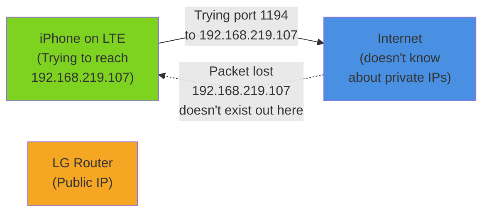

## DDNS First, For a Reason

I started with DDNS even though it seems like a later step. The reason: I need the hostname in the OpenVPN config file before I can test the connection. So setting it up first makes sense.

**On the Archer C6:**

1. VPN Server → OpenVPN Server → DDNS
2. Service Provider: TP-Link
3. Check the hostname that gets assigned (mine was `samcho.tplinkddns.com`)

That hostname will always point to the Archer's current public IP, even if the ISP changes it. This is crucial for the VPN — instead of hardcoding an IP that might change tomorrow, the client uses a stable name.

## OpenVPN Server: Generate, Configure, Export

Still on the Archer C6:

1. VPN Server → OpenVPN Server
2. Enable OpenVPN Server
3. Service Port: leave at 1194 (UDP)
4. Generate certificate and key (the router handles this)
5. Export the `.ovpn` configuration file

The exported file is what I'll install on my iPhone. It contains the certificate, the server address, port — everything the client needs to know.

## Port Forwarding on the LG U+ Router

This is the gatekeeping step. The LG router is blocking inbound connections by default. I need to tell it: "UDP traffic on port 1194? Send it to the Archer."

But first, I need to know what IP the Archer actually has. The Archer itself shows a different IP internally (192.168.0.1, where devices on the Archer network see it). The "WAN" IP is what it looks like from the LG router's perspective.

**On the Archer:** System Tools → System Settings → WAN IP shows `192.168.219.107`.

**On the LG U+ router:** NAT/Port Forwarding → Port Forwarding
- External Port: 1194 (UDP)
- Internal IP: 192.168.219.107
- Internal Port: 1194
- Enable: Yes

Now any UDP packet hitting port 1194 on the public internet will be forwarded to the Archer.

## DHCP Static Binding

If the Archer reboots and gets assigned a different IP — say, 192.168.219.108 — the port forwarding rule still points to 192.168.219.107 and traffic disappears.

**On the LG router:** Network → DHCP → Address Reservation
- Device: Archer C6 (its MAC address)
- IP Address: 192.168.219.107 (lock it in)

Now the Archer will always get the same IP from the LG router, and port forwarding stays valid across reboots.

## The First Test: iPhone + LTE

I installed OpenVPN Connect on my iPhone and imported the `.ovpn` file. This is the critical part: **I have to test on LTE or 5G, not home Wi-Fi.** If I'm on home Wi-Fi, I'm already on the network — VPN won't tell me if the configuration is right. I need to be on a completely different network to know if the traffic actually reaches the Archer.

Connected on LTE. Opened OpenVPN Connect. Hit connect.

**Connection Timeout.**

## The Bug: Private IP in the Config

I sat with that error for a minute, then I opened the `.ovpn` file to see what was actually in there.

```
remote 192.168.219.107 1194 udp
```

There it is. The `remote` line is pointing to a **private IP address**. That's the bug.

When the Archer generates the `.ovpn` file, it writes its own WAN IP as the remote address. That makes sense from its perspective — it knows it's at 192.168.219.107. But that IP is private. It only means something inside the LG router's network. From the internet (from my iPhone on LTE), that address is unreachable.

This is a direct consequence of double NAT. The Archer doesn't know the public IP. It can't reach the internet and check "what's my public IP?" It only sees the private IP the LG router gave it.



The fix is simple: **edit the `remote` line to use the DDNS hostname.**

```
remote samcho.tplinkddns.com 1194 udp
```

Now when the iPhone connects:
1. Resolve `samcho.tplinkddns.com` → your current public IP
2. Send UDP 1194 to that public IP
3. LG router sees port 1194 on its public IP → forwards to 192.168.219.107 (Archer)
4. Archer receives the connection → tunnel established

I re-imported the modified `.ovpn` file on iPhone. Connected again.

**Connected.** The tunnel was live.

## Guest Network: Isolation Without Interaction

Now that VPN is working, I need a place for IoT devices to live without being able to touch my MacBook traffic.

**On the Archer:** Wireless → Guest Network
- Enable Guest Network
- SSID: something descriptive (I used `home-iot`)
- Disable "Allow guests to access my local network" (or equivalent — exact wording varies by router)
- Enable "Isolate wireless clients" (guests can't see each other either)

Currently I only have one Matter switch, and I haven't put it on the guest network yet. I'm waiting for the Samsung SmartThings hub to arrive — that's the central controller for multiple IoT devices. Once it's here, both the hub and any devices it controls will live on the guest network.

The beauty of this setup: even if the SmartThings hub or a connected device gets compromised, it's on a different network segment. It can access the internet (for updates, cloud communication) but not my MacBook.

## What's Done, What's Next

VPN is functional. I can connect from anywhere on the internet and access the Archer. But the Archer itself isn't useful yet — I haven't attached anything to it. The next step is making the MacBook accessible over the VPN with file sharing and remote desktop.

---

| Post | Title |
|---|---|
| ← Previous | [[en/router-vpn-01\|Part 1: Why I Built It and How I Designed It]] |
| → Next | [[en/router-vpn-03\|Part 3: MacBook as Home Server]] |
