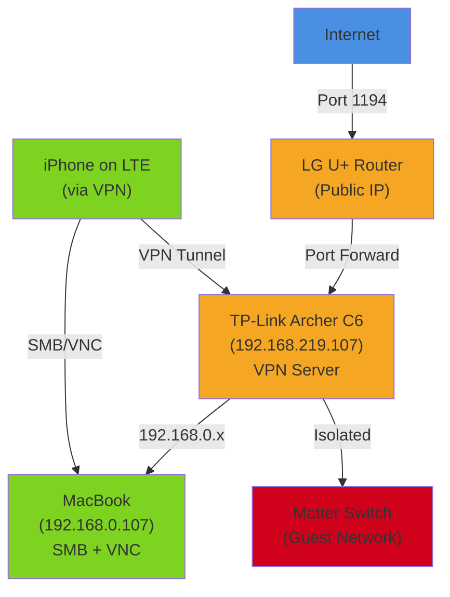

The LG router's USB port is blocked by ISP firmware. The Archer has no USB port. A standalone NAS felt like overkill. **MacBook is already sitting there** — so: MacBook becomes the file server and remote desktop.

Two goals, both over the VPN tunnel:
1. **SMB file sharing** — access MacBook files from iPhone
2. **VNC remote desktop** — see and control the MacBook screen from iPhone

## SMB: File Sharing in System Settings

macOS makes this easy.

1. System Settings → General → Sharing
2. File Sharing: enable it
3. Check which user account to share from (the dropdown menu below)
4. macOS will ask for a password re-entry (it does this for security-sensitive changes)

That's it. The MacBook is now an SMB server on the network.

## The Static IP Problem — and Private Wi-Fi Address

I need the MacBook at a consistent IP so I can reference it in my notes and muscle memory. Let me set up address reservation on the Archer.

I looked up the MacBook's MAC address:
- System Settings → Wi-Fi → Details → MAC Address

Let's say it's `aa:bb:cc:dd:ee:ff`. I'll add a reservation on the Archer:

**On Archer:** DHCP → Address Reservation
- MAC Address: `aa:bb:cc:dd:ee:ff`
- IP Address: 192.168.0.107

Reboot the MacBook, reconnect to Wi-Fi. It should get 192.168.0.107.

But it doesn't. It got 192.168.0.224 instead.

I checked the Archer's DHCP client list. There are **two MacBook entries**:
- `macbook pro` — no IP assigned yet (or different IP)
- `samcho` — got 192.168.0.224

That's weird. I only have one MacBook.

Then I looked at the MAC addresses. The `samcho` entry has a MAC that doesn't match `aa:bb:cc:dd:ee:ff`. It's something like `aa:bb:cc:22:33:44` — the first three octets are the same (Apple's vendor prefix) but the last three are different.

**This is Private Wi-Fi Address.**

Apple's feature, enabled by default since Big Sur, generates a random MAC address for each network you connect to. It's for privacy — networks can't track you by MAC across different locations. But it means the actual client connecting to my Archer isn't the MAC I looked up. It's a randomized proxy.

The reservation rule I created was looking for `aa:bb:cc:dd:ee:ff`. The actual connecting client was `aa:bb:cc:22:33:44`. No match, so DHCP gave it a different address.

## Turning Off Private Wi-Fi Address (For Home Only)

**On the MacBook:**

1. Wi-Fi icon (top right) → Wi-Fi Settings
2. Find your home network in the list → Details
3. Private Wi-Fi Address: toggle OFF

Reconnect to Wi-Fi. Now the MacBook sends its real MAC to the network. DHCP matches the reservation rule and assigns 192.168.0.107.

**Important note:** This is a per-network setting. I turned it OFF for home Wi-Fi only. It stays ON for coffee shops, offices, any public network. That's the right balance — privacy where it matters, stability where I control the network.

## Testing SMB from iPhone

VPN connected on iPhone. Files app open.

1. Files app → three-dot menu → Connect to Server
2. Enter: `smb://192.168.0.107`
3. When prompted: use MacBook account (username + password)

The MacBook's folders appear in Files. I can copy files to/from iPhone. The connection is encrypted through the VPN tunnel.

Tested on LTE too — works just as well. The VPN makes the home network reachable from anywhere.

## VNC: Remote Desktop, With a Twist

I wanted to see and control the MacBook screen from iPhone. That's VNC. But macOS has two overlapping features:

1. **Screen Sharing** — basic remote desktop
2. **Remote Management** — superset of Screen Sharing, includes file transfer, app management, all of it

When I tried to enable Screen Sharing, I got an error:

> This service is currently being controlled by the Remote Management service.

Turns out Remote Management was already on (maybe enabled by default, maybe from a previous attempt). It's the superset, so if it's on, Screen Sharing is handled by it.

I went to Settings → General → Remote Management → Options and checked all the boxes:
- Observe
- Control
- Copy or Paste
- Delete or Replace
- Reboot

Then: Computer Settings → Set VNC Password

That password is what I'll enter on the iPhone to unlock screen control.

## VNC Client on iPhone

I installed RealVNC's **VNC Viewer** (free on App Store).

1. Add connection: `192.168.0.107`
2. When connecting, it warns "Unencrypted Connection"
3. That warning is fine — the VPN tunnel handles encryption, so VNC traffic is already encrypted end-to-end

Enter the VNC password. A moment later: the MacBook desktop appears on my iPhone screen.

I can swipe to move the cursor, tap to click, two-finger tap to right-click. Not ideal for heavy use, but for checking on something or making a quick change, it's surprisingly functional.

## Keep It Awake

The MacBook normally sleeps after a while. That breaks the whole setup — you can't access a sleeping Mac over the network.

Two options:

1. **System Settings → Energy Saver → "Wake for network access"** — the MacBook sleeps but wakes up when the network calls it (SMB or VNC attempts)

2. **Amphetamine app** — free third-party tool that prevents sleep with more granular control

I'm using the native option for now. Works fine.

## The Complete Architecture

Here's what the whole setup looks like now:

From anywhere, I can connect to the VPN. Once connected, I'm on the Archer's network. I can browse MacBook files via SMB. I can see the MacBook desktop via VNC and control it. The guest network stays isolated.

The guest network is ready and waiting — Samsung SmartThings hub is on the way. Once it arrives, IoT devices move there for real.
