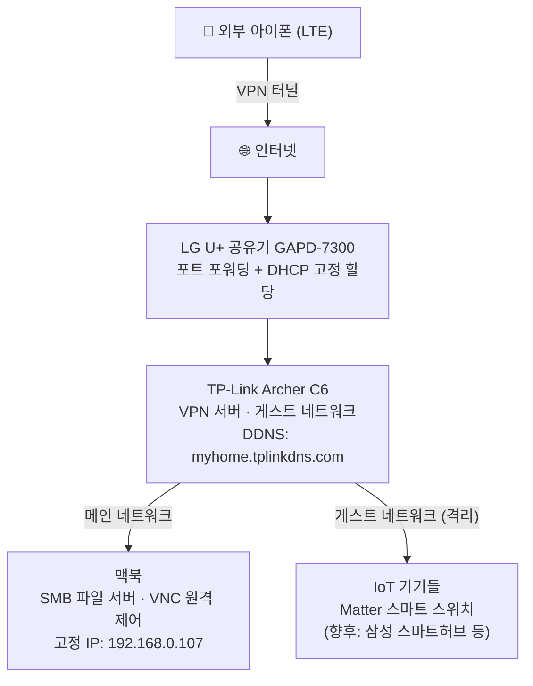
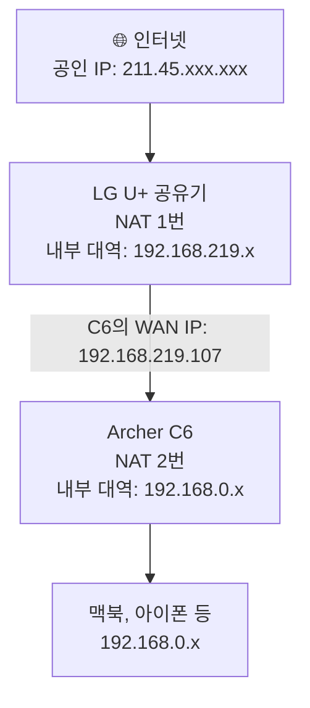

# 자취방 홈 인프라 구축기 1편: 왜 만들었고, 어떻게 설계했나

## 시작은 IoT였다

최근 스마트홈에 빠지기 시작했다. Matter 기반 스마트 스위치를 하나 들여놓으면서, 조만간 삼성 스마트허브 같은 기기들도 들일 계획이 생겼다. 그러다 문득 걱정이 생겼다. IoT 기기들은 보안에 취약하다는 이야기를 종종 들었는데, 내 맥북이나 폰과 같은 네트워크에 붙어 있는 게 맞는 걸까?

그 생각이 꼬리를 물면서 장롱 속에 잠들어 있던 **TP-Link Archer C6**가 떠올랐다. 이전 집은 공유기를 직접 사야 했어서 샀는데, 지금 자취방은 LG U+를 쓰게 되어 있어서 그냥 넣어뒀던 것이다.

이 공유기로 뭔가를 해볼 수 있지 않을까.

## 왜 VPN 서버를 선택했나

공유기 활용 방법을 알아보니 크게 네 가지가 나왔다: 와이파이 확장기, 무선 랜카드 대용, 스위칭 허브, 그리고 VPN 서버. 나머지 셋은 내 상황에 필요가 없었다.

- **와이파이 확장기**: 자취방이 확장기가 필요할 만큼 넓지 않다.
- **무선 랜카드 대용**: 맥북을 써서 무관하다.
- **스위칭 허브**: LAN 포트에 연결할 유선 기기가 없다.

VPN 서버만 남았는데, 마침 한 가지가 더 있었다. 최근에 이직을 했는데, 새 회사의 네트워크 인프라를 이해하고 싶었다. 포트 포워딩이나 망 분리 같은 개념을 직접 손으로 구성해보면, 회사에서 마주치는 인프라 설계도 더 직관적으로 읽힐 것 같았다.

보안과 학습, 두 가지 이유로 VPN 서버를 선택했다.

## 목표 아키텍처

처음부터 VPN 하나만 만들 생각은 아니었다. 세 가지를 목표로 잡았다.

1. **VPN 서버**: 외부에서 집 네트워크로 안전하게 접속할 수 있는 암호화 터널
2. **맥북 홈서버**: 집 맥북을 파일 서버(SMB)와 원격 제어(VNC)가 가능한 서버로 구성
3. **IoT 네트워크 분리**: IoT 기기들은 메인 네트워크와 격리된 게스트 네트워크에 연결

완성된 구조는 이렇다:

이 구조를 만드는 과정에서 가장 먼저 이해해야 했던 개념이 하나 있다. **이중 NAT**다.

## 이중 NAT란?

NAT(Network Address Translation)는 공유기가 집 안 기기들의 사설 IP와 인터넷의 공인 IP 사이를 번역해주는 과정이다. 일반적인 환경에서는 공유기 하나, NAT 하나다.

그런데 LG U+ 공유기 아래에 Archer C6를 연결하면 NAT가 두 번 일어난다. 이걸 이중 NAT라고 한다.

문제는 VPN 서버 입장에서 생긴다. 외부에서 아이폰이 집 VPN에 접속하려면 인터넷 → LG 공유기 → Archer C6 순서로 신호가 전달되어야 하는데, LG 공유기는 기본적으로 외부에서 들어오는 연결을 모두 차단한다. "이 신호를 Archer C6로 보내라"는 규칙을 명시적으로 설정해줘야 한다.

이게 **포트 포워딩**이다.

그리고 포트 포워딩을 설정할 때 "Archer C6의 주소는 `192.168.219.107`이다"라고 지정해두는데, LG 공유기를 재부팅하면 이 주소가 바뀔 수 있다. 이를 막으려면 **DHCP 고정 할당**이 필요하다.

마지막으로, 외부에서 접속할 때 집의 공인 IP를 주소로 쓰는데, 인터넷 공인 IP는 통신사가 수시로 바꾼다. 이를 해결하는 게 **DDNS** — 항상 같은 이름으로 접속할 수 있도록 IP를 이름에 연결해두는 서비스다.

정리하면, 이중 NAT 환경에서 VPN 서버를 운영하려면 세 가지가 필요하다:

| 필요한 것 | 역할 |
|---|---|
| 포트 포워딩 | LG 공유기가 VPN 신호를 Archer C6로 전달하도록 설정 |
| DHCP 고정 할당 | Archer C6의 내부 IP가 바뀌지 않도록 고정 |
| DDNS | 집 공인 IP가 바뀌어도 항상 같은 이름으로 접속 가능 |

다음 편에서 이 세 가지를 포함한 VPN 서버 구축 전 과정을 다룬다.

---

| 편 | 제목 |
|---|---|
| → 다음 | [[ko/router-vpn-02\|2편: VPN 서버 구축 — DDNS부터 Connection Timeout 해결까지]] |
