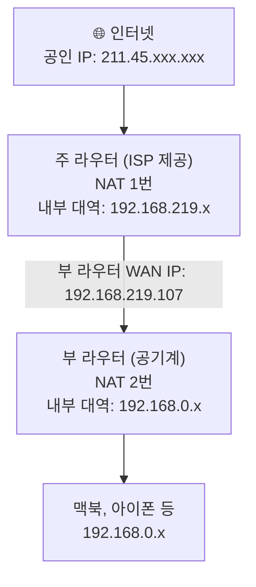

# 자취방 홈 인프라 구축기 1편: 왜 만들었고, 어떻게 설계했나

## 시작은 유튜브였다

자취남 채널을 보다가 자취방 IoT 세팅 영상을 봤다. 조명을 자동으로 켜고 끄고, 스마트폰으로 원격으로 확인하는 것들이 생각보다 어렵지 않아 보였다. 영상 보고 바로 Matter 기반 스마트 스위치를 하나 질렀다.

직접 달아보니 확실히 재밌었다. 자연스럽게 다음 생각이 이어졌다. 집에 있는 다른 기기들도 뭔가 활용할 수 있지 않을까.

그러다 장롱 속에 잠들어 있던 **공유기 공기계**가 떠올랐다. 이전 집은 공유기를 직접 사야 했는데, 지금 자취방은 주 라우터가 기본 제공되어서 그냥 넣어뒀던 것이다.

## 왜 VPN 서버를 선택했나

이 공유기로 뭘 할 수 있을지 Gemini에게 물어봤다. 나온 선택지는 크게 네 가지였다: 와이파이 확장기, 무선 랜카드 대용, 스위칭 허브, 그리고 VPN 서버. 앞의 셋은 내 상황에 필요가 없었다.

- **와이파이 확장기**: 자취방이 확장기가 필요할 만큼 넓지 않다.
- **무선 랜카드 대용**: 맥북을 써서 무관하다.
- **스위칭 허브**: LAN 포트에 연결할 유선 기기가 없다.

VPN 서버만 남았는데, Gemini가 한 가지를 덧붙였다. VPN 라우터를 쓰면 IoT 기기들을 게스트 네트워크에 격리할 수 있다고. 처음엔 부수적인 이야기로 들었는데, 생각해보니 신경이 쓰였다. 스마트 스위치 같은 기기가 내 맥북과 같은 네트워크에 붙어 있어도 되는 걸까. IoT 기기는 보안이 취약하다는 이야기를 자주 들었는데.

거기다 최근 이직을 했는데, 새 회사에서 인프라 관련 업무를 더 접하게 됐다. 포트 포워딩이나 망 분리 같은 개념을 직접 손으로 구성해보면 회사에서 마주치는 인프라 설계도 더 직관적으로 읽힐 것 같았다.

보안과 학습, 두 가지 이유로 VPN 서버를 선택했다.

## 어쩌다 여기까지 왔나

처음엔 "VPN이 뭔지 배워보자" 정도였다. Gemini와 대화하다 보니 아이디어가 하나씩 붙기 시작했다.

VPN이 되면 외부에서 집 네트워크에 접속할 수 있다. 접속할 수 있으면 맥북에 파일도 쌓고 화면도 제어할 수 있다. 부 라우터에 게스트 네트워크를 만들면 IoT 기기들을 맥북과 분리할 수 있다.

그렇게 대화 끝에 나온 구조가 이렇다:

이 구조를 만드는 과정에서 가장 먼저 이해해야 했던 개념이 하나 있다. **이중 NAT**다.

## 이중 NAT란?

공유기 하나면 NAT도 하나다. 그런데 주 라우터 아래에 부 라우터를 연결하면 NAT가 두 번 일어난다.

VPN 서버를 만들려면 여기서 세 가지 문제가 생긴다. 주 라우터는 기본적으로 외부 연결을 모두 차단하므로 부 라우터로 신호를 넘기는 **포트 포워딩** 규칙이 필요하다. 포트 포워딩에는 부 라우터의 주소를 고정해야 하므로 **DHCP 고정 할당**이 필요하다. 그리고 집 공인 IP는 통신사가 수시로 바꾸므로 항상 같은 이름으로 접속할 수 있는 **DDNS**가 필요하다.

다음 편에서 이 세 가지를 구성한다.
