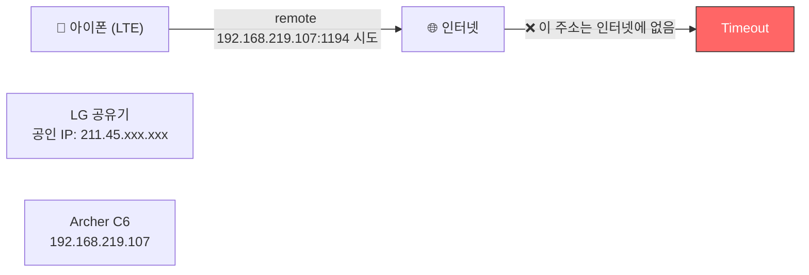
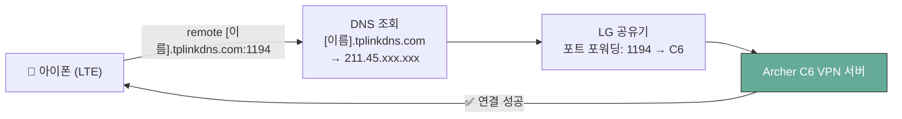

# 자취방 홈 인프라 구축기 2편: VPN 서버 구축 — DDNS부터 Connection Timeout 해결까지

[[ko/router-vpn-01|1편]]에서 이중 NAT 구조와 필요한 세 가지(포트 포워딩, DHCP 고정, DDNS)를 정리했다. 이번 편에서 실제로 구성한다.

> **환경**
> - LG U+ 공유기 GAPD-7300 (상단)
> - TP-Link Archer C6 (하단, LG 공유기 LAN 포트에 연결)
> - 아이폰 (OpenVPN 클라이언트 테스트용)

---

## 1. DDNS 설정

Archer C6 관리 페이지(`tplinkwifi.net` 또는 `192.168.0.1`)에 접속한다.

**고급 → 네트워크 → Dynamic DNS**로 이동해 TP-Link를 서비스 제공자로 선택하고, TP-Link ID로 로그인한다. 원하는 이름을 입력하면 `[이름].tplinkdns.com` 형태의 무료 도메인이 생성된다.

이걸 먼저 설정하는 이유가 있다. 곧 설명할 `.ovpn` 파일 안에 이 이름이 들어가야 하는데, 나중에 생성하면 파일을 다시 내보내야 하는 번거로움이 생긴다.

## 2. OpenVPN 서버 활성화

**고급 → VPN 서버 → OpenVPN**으로 이동한다.

- VPN 서버 활성화 체크
- 서비스 유형: **UDP**, 포트: **1194** (기본값)
- 저장 후 **인증서 생성(Generate)** 클릭
- 생성 완료 후 **구성 내보내기(Export Configuration)** 클릭 → `.ovpn` 파일 저장

## 3. LG U+ 공유기에 포트 포워딩

먼저 Archer C6의 WAN IP를 확인한다. **고급 → 상태**에서 인터넷 항목의 IP를 본다. 보통 `192.168.219.xxx` 형태다.

`192.168.219.1`로 LG 공유기 관리 페이지에 접속한다 (공유기 바닥 스티커의 웹 설정 암호로 로그인).

**네트워크 설정 → NAT 설정 → 포트 포워딩**에서 아래 규칙을 추가한다:

| 항목 | 값 |
|---|---|
| 프로토콜 | UDP |
| 외부 포트 | 1194 |
| 내부 IP | Archer C6의 WAN IP (예: `192.168.219.107`) |
| 내부 포트 | 1194 |

## 4. 아이폰에 OpenVPN Connect 설치

App Store에서 **OpenVPN Connect** 설치 후, `.ovpn` 파일을 아이폰으로 전송한다 (카카오톡 나에게 보내기, 이메일, AirDrop 등).

파일을 탭하면 OpenVPN으로 열기 옵션이 뜬다. ADD → 허용 → 스위치를 켜서 연결.

> **테스트는 반드시 LTE/5G 상태에서**: 집 와이파이에서는 VPN이 제대로 작동하는지 확인할 수 없다.

---

## 5. Connection Timeout — 그리고 원인

와이파이를 끄고 LTE 상태에서 연결을 시도했다. 결과는 `Connection Timeout`.

`.ovpn` 파일을 텍스트 편집기로 열어보니 원인이 바로 보였다:

```
remote 192.168.219.107 1194
```

`192.168.219.107`은 LG 공유기가 Archer C6에 부여한 **사설 IP**다. 인터넷 세상에 존재하지 않는 주소다. 외부에서 이 주소로 연결을 시도하면 어디에도 닿지 못한다.

왜 공유기가 이걸 파일에 넣었냐면, Archer C6 입장에서는 자신의 인터넷 주소가 `192.168.219.107`인 줄 안다. 실제 공인 IP가 LG 공유기에 있다는 사실을 C6는 알 방법이 없다. 이중 NAT 환경에서 자동 생성 설정 파일에 필연적으로 발생하는 문제다.



### 해결: DDNS 주소로 교체

`.ovpn` 파일을 텍스트 편집기로 열어 `remote` 줄만 수정한다:

```
# 수정 전
remote 192.168.219.107 1194

# 수정 후
remote [내DDNS이름].tplinkdns.com 1194
```

수정한 파일을 아이폰에 다시 등록하고 (기존 프로필 삭제 후 ADD), LTE 상태에서 재시도.



---

## 6. Archer C6 IP 고정 (DHCP 고정 할당)

VPN이 잘 되더라도 LG 공유기를 재부팅하면 Archer C6의 IP가 `192.168.219.107`에서 다른 주소로 바뀔 수 있다. 그러면 포트 포워딩 규칙이 엉뚱한 주소를 가리키게 되어 VPN이 다시 끊긴다.

LG 공유기 관리 페이지 → **상태 정보 → DHCP 할당 정보**에서 Archer C6를 찾아 고정 할당을 설정한다. 이후로는 재부팅에도 항상 같은 IP를 받는다.

## 7. 게스트 네트워크 설정

VPN 서버와 게스트 네트워크는 충돌 없이 동시에 운영할 수 있다.

**고급 → 무선 → 게스트 네트워크**에서 활성화 후 두 가지 옵션을 확인한다:

| 옵션 | 설정값 |
|---|---|
| 로컬 네트워크 액세스 허용 | **비활성화** — 게스트가 내 맥북 등 내부 기기에 접근 불가 |
| 게스트 기기 간 통신 차단 | **활성화** — 같은 게스트 와이파이 기기들끼리도 격리 |

현재는 IoT 기기가 Matter 스마트 스위치 하나뿐이라 아직 게스트 네트워크에 연결하지 않았지만, 삼성 스마트허브 등 기기가 늘어나면 게스트 네트워크를 IoT 전용으로 쓸 계획이다.

---

VPN 서버 구성이 완료됐다. 다음 편에서는 집 맥북을 파일 서버와 원격 제어 서버로 만드는 과정을 다룬다. 여기서도 예상치 못한 트러블슈팅이 하나 기다리고 있었다.

---

| 편 | 제목 |
|---|---|
| ← 이전 | [[ko/router-vpn-01\|1편: 왜 만들었고, 어떻게 설계했나]] |
| → 다음 | [[ko/router-vpn-03\|3편: 맥북 홈서버 — SMB, VNC, 그리고 Private MAC 문제]] |
