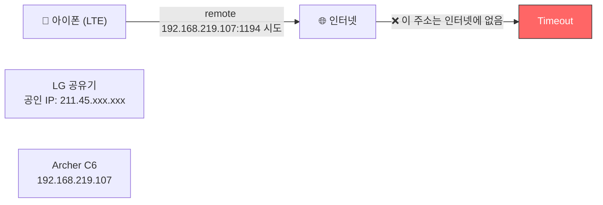
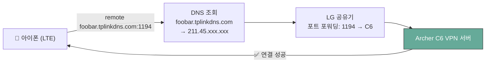

## 이 글이 도움 되는 독자

- 이중 NAT 환경에서 OpenVPN을 처음 붙여보는 개발자
- `Connection Timeout` 같은 모호한 증상을 구조적으로 디버깅하고 싶은 사람

이 글에서는 Archer C6 + LG U+ 이중 공유기 환경에서 VPN이 실패한 이유를 추적하고, DDNS/포트 포워딩 조합으로 복구한 과정을 다룬다.

## 접근 방법 비교와 선택 기준

| 접근 | 장점 | 이번 선택/제외 이유 |
|---|---|---|
| 공유기 기본 OpenVPN 사용 | 추가 설치 없이 즉시 시작 가능 | **선택**. 가장 빠르게 검증 가능 |
| WireGuard 별도 구축 | 성능/단순성 이점 가능 | 공유기 순정 펌웨어 제약으로 이번 범위에서 제외 |
| 외부 SaaS VPN(Tailscale 등) | NAT 우회가 쉬움 | 네트워크 내부 동작 원리 학습 목적과 거리 있음 |

이번 편의 기준은 `빠른 실험`, `이중 NAT 원리 이해`, `실패 원인 재현 가능성`이었다.

## 1. DDNS 설정

Archer C6 관리 페이지(`tplinkwifi.net` 또는 `192.168.0.1`)에 접속한다.

**고급 → 네트워크 → Dynamic DNS**로 이동해 TP-Link를 서비스 제공자로 선택하고, TP-Link ID로 로그인한다. 원하는 이름을 입력하면 `foobar.tplinkdns.com` 형태의 무료 도메인이 생성된다.

이걸 먼저 설정하는 이유가 있다. 곧 설명할 `.ovpn` 파일 안에 이 이름이 들어가야 하는데, 나중에 생성하면 파일을 다시 내보내야 하는 번거로움이 생긴다.

## 2. OpenVPN 서버 활성화

**고급 → VPN 서버 → OpenVPN**으로 이동한다.

- VPN 서버 활성화 체크
- 서비스 유형: **UDP**, 포트: **1194** (기본값)
- 저장 후 **인증서 생성(Generate)** 클릭
- 생성 완료 후 **구성 내보내기(Export Configuration)** 클릭 → `.ovpn` 파일 저장

내보낸 파일은 아이폰에 설치할 클라이언트 설정이며, 인증서/서버 주소/포트 정보가 모두 포함된다.

## 3. LG U+ 공유기에 포트 포워딩

먼저 Archer C6의 WAN IP를 확인한다. **고급 → 상태**에서 인터넷 항목의 IP를 본다. 보통 `192.168.219.xxx` 형태다.

`192.168.219.1`로 LG 공유기 관리 페이지에 접속한다 (공유기 바닥 스티커의 웹 설정 암호로 로그인).

**네트워크 설정 → NAT 설정 → 포트 포워딩**에서 아래 규칙을 추가한다:

| 항목 | 값 |
|---|---|
| 프로토콜 | UDP |
| 외부 포트 | 1194 |
| 내부 IP | Archer C6의 WAN IP (예: `192.168.219.107`) |
| 내부 포트 | 1194 |

## 4. 아이폰에 OpenVPN Connect 설치

App Store에서 **OpenVPN Connect** 설치 후, `.ovpn` 파일을 아이폰으로 전송한다 (카카오톡 나에게 보내기, 이메일, AirDrop 등).

파일을 탭하면 OpenVPN으로 열기 옵션이 뜬다. ADD → 허용 → 스위치를 켜서 연결.

> **테스트는 반드시 LTE/5G 상태에서**: 집 와이파이에서는 VPN이 제대로 작동하는지 확인할 수 없다.

---

## 5. Connection Timeout — 그리고 원인

와이파이를 끄고 LTE 상태에서 연결을 시도했다. 결과는 `Connection Timeout`.

`.ovpn` 파일을 텍스트 편집기로 열어보니 원인이 바로 보였다:

```
remote 192.168.219.107 1194
```

`192.168.219.107`은 LG 공유기가 Archer C6에 부여한 **사설 IP**다. 인터넷에는 존재하지 않는 주소. Archer C6는 자신의 공인 IP를 알 방법이 없고, 이중 NAT 환경에서 자동 생성된 파일에 사설 IP가 들어가는 건 필연이다.



### 해결: DDNS 주소로 교체

`.ovpn` 파일을 텍스트 편집기로 열어 `remote` 줄만 수정한다:

```
# 수정 전
remote 192.168.219.107 1194

# 수정 후
remote foobar.tplinkdns.com 1194
```

수정한 파일을 아이폰에 다시 등록하고 (기존 프로필 삭제 후 ADD), LTE 상태에서 재시도.



---

## 6. Archer C6 IP 고정 (DHCP 고정 할당)

VPN이 잘 되더라도 LG 공유기를 재부팅하면 Archer C6의 IP가 `192.168.219.107`에서 다른 주소로 바뀔 수 있다. 그러면 포트 포워딩 규칙이 엉뚱한 주소를 가리키게 되어 VPN이 다시 끊긴다.

LG 공유기 관리 페이지 → **상태 정보 → DHCP 할당 정보**에서 Archer C6를 찾아 고정 할당을 설정한다. 이후로는 재부팅에도 항상 같은 IP를 받는다.

## 7. 게스트 네트워크 설정

VPN 서버와 게스트 네트워크는 충돌 없이 동시에 운영할 수 있다.

**고급 → 무선 → 게스트 네트워크**에서 활성화 후 두 가지 옵션을 확인한다:

| 옵션 | 설정값 |
|---|---|
| 로컬 네트워크 액세스 허용 | **비활성화** — 게스트가 내 맥북 등 내부 기기에 접근 불가 |
| 게스트 기기 간 통신 차단 | **활성화** — 같은 게스트 와이파이 기기들끼리도 격리 |

아직 IoT 기기가 스마트 스위치 하나뿐이라 게스트 네트워크에 올리지는 않았다. 삼성 스마트허브가 오면 그때부터 본격적으로 쓸 예정.

## 적용 결과 (전/후)

| 지표 | 변경 전 | 변경 후 |
|---|---|---|
| LTE에서 OpenVPN 연결 | `Connection Timeout` | 연결 성공 |
| `.ovpn`의 `remote` 값 | 사설 IP(`192.168.219.107`) | DDNS 도메인(`foobar.tplinkdns.com`) |
| 재부팅 후 라우터 대상 일관성 | 변동 가능 | DHCP 고정 할당으로 유지 |

## 회고 (한계와 다음 개선)

- 현재 결과는 "연결 성공/실패" 중심이다. 다음 업데이트에서는 연결 시간, 재접속 안정성 같은 운영 지표를 추가할 수 있다.
- 공유기 펌웨어가 자동으로 올바른 `remote`를 넣어주지 못하는 구조적 한계가 있다.
- 게스트 네트워크는 준비만 완료했고, 실제 IoT 다기기 운영 결과는 아직 수집 전이다.

## FAQ

Q. 왜 테스트를 LTE/5G에서 해야 하나?  
A. 같은 집 와이파이에서 테스트하면 VPN 경로를 실제로 검증하지 못한다. 외부망에서 붙어야 포트 포워딩과 DDNS 경로가 검증된다.

Q. `remote`를 공인 IP로 직접 넣으면 안 되나?  
A. 가능하지만 공인 IP가 바뀌면 설정을 다시 바꿔야 한다. DDNS를 쓰면 같은 도메인으로 계속 접속 가능하다.

Q. 포트 포워딩만 하면 충분한가?  
A. 아니다. 대상 장비 IP가 바뀌면 규칙이 무효가 되므로 DHCP 고정 할당이 함께 필요하다.

Q. 게스트 네트워크를 켜면 VPN이 느려지나?  
A. 일반적으로 직접 충돌하지 않는다. 다만 라우터 성능 한계가 있는 환경에서는 동시 트래픽이 많을 때 체감 저하가 생길 수 있다.
