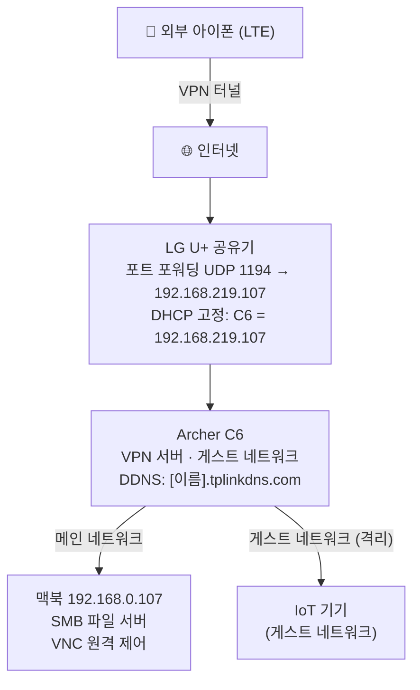

# 자취방 홈 인프라 구축기 3편: 맥북 홈서버 — SMB, VNC, 그리고 Private MAC 문제

VPN 터널이 뚫렸으니 그 끝에 뭔가를 붙여야 한다. LG 공유기 USB 포트에 외장 하드를 붙이려 했는데 통신사 펌웨어에서 막혀 있었다. Archer C6는 USB 포트 자체가 없다. 별도 NAS는 과하고 — **맥북이 있다.**

목표는 두 가지:
- **SMB 파일 공유**: 아이폰에서 맥북 파일에 접근
- **VNC 원격 제어**: 아이폰에서 맥북 화면 제어

---

## 1. 맥북 SMB 파일 공유 활성화

**시스템 설정 → 일반 → 공유 → 파일 공유** 스위치를 켠다.

옆의 `i` 아이콘을 눌러:
- 공유할 폴더를 추가한다.
- **옵션**에서 'SMB를 사용하여 파일 및 폴더 공유'에 체크하고, 계정에도 체크한다 (맥북 로그인 암호 재입력 필요).

## 2. 맥북 IP 고정 — 그리고 예상치 못한 문제

외부에서 접속할 때 맥북 주소가 매번 바뀌면 불편하다. Archer C6에서 맥북의 IP를 고정해줘야 한다.

**Archer C6 관리 페이지 → 고급 → 네트워크 → DHCP 서버 → 주소 예약**으로 이동해 맥북의 MAC 주소를 등록하고 IP를 `192.168.0.107`로 예약했다.

그런데 와이파이를 껐다 켜도 맥북이 계속 `192.168.0.224`를 받았다.

### 원인: Private Wi-Fi Address

공유기 클라이언트 목록을 보니 맥북으로 보이는 항목이 두 개였다:

- `macbook pro` — MAC 주소가 `en0` 하드웨어 주소와 다름
- `samcho` — MAC 주소가 `en0` 하드웨어 주소와 일치

`macbook pro` 항목이 실제로 접속 중인 기기였고, 그 MAC 주소는 맥북이 공유기에 보고하는 **임의 생성 주소**였다.

애플은 iOS 14, macOS Big Sur부터 프라이버시 보호를 위해 와이파이 네트워크마다 실제 하드웨어 주소 대신 무작위 MAC 주소를 사용하는 **Private Wi-Fi Address** 기능을 기본으로 켜뒀다. 덕분에 공유기는 맥북의 실제 `en0` 주소를 볼 수 없었고, 예약 규칙이 적용되지 않았다.

### 해결: 해당 네트워크에서만 끄기

맥북 상단 바 Wi-Fi 아이콘 클릭 → **Wi-Fi 설정** → 현재 접속 중인 네트워크 옆 **세부사항** → Wi-Fi 탭 → **비공개 Wi-Fi 주소**를 **끔**으로 변경.

와이파이를 껐다 켜면 `en0` 실제 주소로 접속하고, 이번엔 예약한 `192.168.0.107`이 정상적으로 할당됐다.

> **참고**: 이 설정은 네트워크별로 다르게 적용된다. 집 와이파이에서만 끄고, 카페나 공용 와이파이에서는 여전히 켜두는 게 맞다.

## 3. 아이폰에서 파일 접근 테스트

아이폰의 OpenVPN을 켜서 VPN 터널로 집 네트워크에 들어온 뒤, **파일 앱 → 서버에 연결 → `smb://192.168.0.107`** 입력 후 맥북 계정으로 로그인.

맥북에서 공유로 지정한 폴더가 아이폰 파일 앱에 나타났다. 외부에서도 마찬가지였다 — LTE 상태에서 VPN을 켜면 집 맥북 파일에 접근할 수 있다.

---

## 4. VNC 원격 제어 설정

파일 접근만으론 부족하다. 맥북 화면 자체를 밖에서 제어할 수 있으면 더 유용하다.

**시스템 설정 → 일반 → 공유**에서 **화면 공유**를 켜려 했는데, 이미 **원격 관리(Remote Management)**가 켜져 있어서 충돌 메시지가 떴다:

> *"This service is currently being controlled by the Remote Management service"*

알고 보니 원격 관리가 화면 공유의 상위 호환이다. 화면 공유는 말 그대로 화면만 보여주는 반면, 원격 관리는 화면 제어 외에 파일 전송, 앱 설치, 터미널 실행 등 더 넓은 권한을 포함한다.

**원격 관리 `i` 아이콘 → 옵션**에서 모든 항목을 체크하고, **컴퓨터 설정**에서 VNC 전용 암호를 설정한다.

### 아이폰에서 VNC 접속

App Store에서 **VNC Viewer** (RealVNC 제공) 설치 후:

1. `+` 버튼 → Address에 `192.168.0.107` 입력 → 저장
2. 연결 시 "Unencrypted Connection" 경고가 뜨는데 무시해도 된다 — 이미 VPN 터널 안에 있어서 암호화는 VPN이 담당하고 있다.
3. VNC 암호 입력 → 맥북 화면이 아이폰에 나타난다.

마찬가지로 LTE 상태에서도 VPN을 켜고 접속하면 동작한다.

### 맥북 잠자기 방지

맥북이 잠들면 파일 공유와 VNC가 모두 끊긴다. 두 가지 방법이 있다:

- **시스템 설정 → 에너지 절약**: '네트워크 액세스 시 잠자기에서 깨우기' 활성화
- **Amphetamine** (App Store 무료): 덮개를 닫아도 맥북이 깨어 있도록 강제

---

## 완성된 구조

---

IoT 기기는 아직 스마트 스위치 하나뿐이라 게스트 네트워크를 본격적으로 쓰진 않고 있다. 삼성 스마트허브가 오면 그때부터 IoT 전용으로 돌릴 예정.
