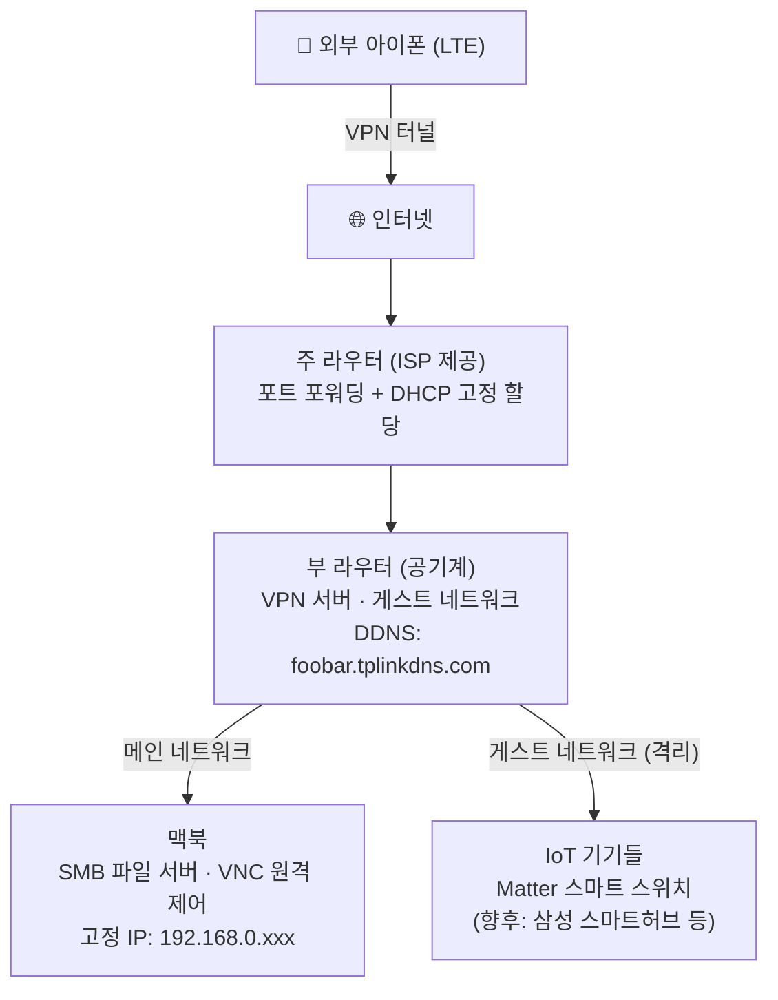
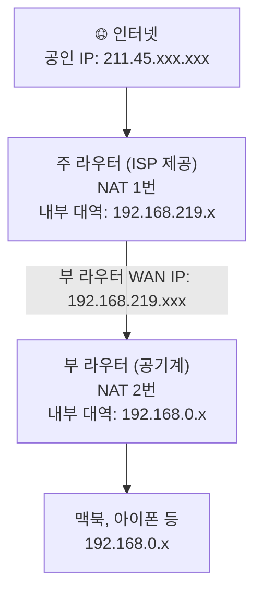

## 이 글이 도움 되는 독자

- 자취방/원룸에서 홈 네트워크를 직접 구성해보고 싶은 백엔드 개발자
- VPN, DDNS, 이중 NAT를 "용어"가 아니라 "설계 판단"으로 이해하고 싶은 사람

이 글에서는 왜 VPN 중심 아키텍처를 선택했는지와, 이후 구현(2편/3편)으로 이어지는 설계 기준을 정리한다.

## 시작은 유튜브였다

자취남 채널을 보다가 자취방 IoT 세팅 영상을 봤다. 조명을 자동으로 켜고 끄고, 스마트폰으로 원격으로 확인하는 것들이 생각보다 어렵지 않아 보였다. 영상 보고 바로 Matter 기반 스마트 스위치를 하나 질렀다.

직접 달아보니 확실히 재밌었다. 자연스럽게 다음 생각이 이어졌다. 집에 있는 다른 기기들도 뭔가 활용할 수 있지 않을까.

그러다 장롱 속에 잠들어 있던 **공유기 공기계**가 떠올랐다. 이전 집은 공유기를 직접 사야 했는데, 지금 자취방은 주 라우터가 기본 제공되어서 그냥 넣어뒀던 것이다.

<!-- TODO: 공기계 Archer C6 사진 → images/router-vpn-01/archer-c6.jpg -->
<figure>
  
  <figcaption>오랫동안 장롱에서 잠들어 있던 TP-Link Archer C6. 이게 VPN 서버가 될 줄이야.</figcaption>
</figure>

## 왜 VPN 서버를 선택했나

이 공유기로 뭘 할 수 있을지 Gemini에게 물어봤다. 나온 선택지는 크게 네 가지였다: 와이파이 확장기, 무선 랜카드 대용, 스위칭 허브, 그리고 VPN 서버. 앞의 셋은 내 상황에 필요가 없었다.

- **와이파이 확장기**: 자취방이 확장기가 필요할 만큼 넓지 않다.
- **무선 랜카드 대용**: 맥북을 써서 무관하다.
- **스위칭 허브**: LAN 포트에 연결할 유선 기기가 없다.

VPN 서버만 남았는데, Gemini가 한 가지를 덧붙였다. VPN 라우터를 쓰면 IoT 기기들을 게스트 네트워크에 격리할 수 있다고. 처음엔 부수적인 이야기로 들었는데, 생각해보니 신경이 쓰였다. 스마트 스위치 같은 기기가 내 맥북과 같은 네트워크에 붙어 있어도 되는 걸까. IoT 기기는 보안이 취약하다는 이야기를 자주 들었는데.

백엔드 개발자로 일하면서 VPN이 뭔지는 알고 있었다. 하지만 직접 구성해본 적은 없었다. DHCP는 이름만 기억하는 수준이었고, NAT가 두 번 일어나면 어떤 문제가 생기는지도 막상 설명하라면 막막했다. 개념이 아니라 설정을 직접 만지면서 이해하고 싶었다.

거기다 최근 이직을 했는데, 새 회사의 인프라를 새로 파악해야 했다. 백엔드 개발자라면 자기 서비스가 돌아가는 인프라 구조를 이해하고 있어야 한다. 포트 포워딩이나 망 분리 같은 개념을 직접 손으로 구성해보면, 사내 인프라 설계도 더 직관적으로 읽힐 것 같았다.

보안과 학습, 두 가지 이유로 VPN 서버를 선택했다.

## 접근 방법 비교와 선택 기준

## 어쩌다 여기까지 왔나

처음엔 "VPN이 뭔지 배워보자" 정도였다. Gemini와 대화하다 보니 아이디어가 하나씩 붙기 시작했다.

VPN이 되면 외부에서 집 네트워크에 접속할 수 있다. 접속할 수 있으면 맥북에 파일도 쌓고 화면도 제어할 수 있다. 부 라우터에 게스트 네트워크를 만들면 IoT 기기들을 맥북과 분리할 수 있다.

그렇게 대화 끝에 나온 구조가 이렇다.

<!-- TODO: 실제 기기 배치 사진(LG 공유기 + Archer C6 + 맥북) → images/router-vpn-01/device-setup.jpg -->
<figure>
  
  <figcaption>LG U+ 공유기(좌), Archer C6(우), 그리고 홈서버로 쓸 맥북. 이 세 개가 전부다.</figcaption>
</figure>

이 구조를 만들면서 처음 맞닥뜨린 개념이 **이중 NAT**였다. 집에 이미 주 라우터가 있다고 했더니 Gemini가 바로 짚어줬다. 생각해보면 당연한 건데, 혼자였으면 한참 헤맸을 것 같다.

## Gemini가 짚어준 기초 개념들

설계를 본격적으로 시작하기 전, Gemini와 대화하면서 먼저 정리한 개념들이 있다. 네트워크를 처음 직접 만져보는 사람이라면 이 용어들이 낯설 수 있어서, 이후 설명에 앞서 간략히 정리해둔다.

**LAN / WAN**
LAN(Local Area Network)은 공유기 안쪽, 즉 집 내부 네트워크다. WAN(Wide Area Network)은 그 바깥, 인터넷 영역이다. 공유기는 이 둘의 경계에 서 있다. 집 안 기기들은 LAN에서 서로 통신하고, 외부와는 공유기를 통해 WAN으로 나간다.

**공인 IP / 사설 IP**
IP 주소에는 두 종류가 있다. 공인 IP(Public IP)는 인터넷에서 유일한 주소로, 통신사(ISP)가 집에 하나를 할당한다. 사설 IP(Private IP)는 공유기 내부에서만 통용되는 주소로, `192.168.x.x` 같은 대역이 여기에 속한다. 맥북의 IP가 `192.168.0.107`인 것처럼. 외부에서 사설 IP로는 직접 접근할 수 없고, 공유기를 반드시 거쳐야 한다.

**MAC 주소**
MAC 주소는 와이파이 칩이나 이더넷 포트 같은 네트워크 인터페이스에 제조사가 부여한 하드웨어 고유 번호다. IP 주소는 어느 네트워크에 접속하느냐에 따라 달라지지만, MAC 주소는 기기 자체에 고정되어 있다. DHCP에서 특정 기기에 항상 같은 IP를 예약할 때 이 MAC 주소를 식별자로 쓴다.

**DHCP**
공유기에 새 기기가 연결되면 자동으로 IP를 배분해주는 프로토콜이다. 편리하지만 기기를 껐다 켜거나 재연결하면 IP가 달라질 수 있다. 서버처럼 주소가 일정해야 하는 기기는 DHCP 예약으로 항상 같은 IP를 받도록 설정한다.

**NAT**
NAT(Network Address Translation)는 공유기가 내부 기기의 사설 IP를 외부 통신 시 공인 IP로 바꿔주는 기술이다. 이 덕분에 집 안 여러 기기가 공인 IP 하나를 공유할 수 있다. 반대로, 외부에서 내부 특정 기기에 직접 접속하려면 NAT를 어떻게 통과할지 별도로 설정해줘야 한다.

**포트 포워딩**
공유기의 특정 포트(번호)로 들어오는 외부 트래픽을 내부의 특정 기기로 넘겨주는 규칙이다. "UDP 1194번 포트로 오는 건 이 IP로 전달해라"는 식으로 설정한다. NAT 환경에서 외부 접속을 허용하는 핵심 방법이다.

**DDNS**
통신사는 공인 IP를 수시로 바꾼다. 어제의 공인 IP와 오늘의 공인 IP가 다를 수 있다는 뜻이다. DDNS(Dynamic DNS)는 공인 IP가 바뀌어도 항상 같은 도메인 이름으로 접속할 수 있게 해주는 서비스다. `foobar.tplinkdns.com` 같은 이름을 등록해두면, 공인 IP가 바뀔 때마다 TP-Link가 도메인이 가리키는 주소를 자동으로 갱신해준다.

**VPN**
VPN(Virtual Private Network)은 외부 장치와 집 네트워크 사이에 암호화된 가상 터널을 만드는 기술이다. 터널 안으로 들어오면 외부 기기가 마치 집 LAN 안에 있는 것처럼 동작한다. 카페에서 아이폰으로 VPN을 켜면, 카페 와이파이에 연결되어 있지만 집 맥북에 직접 접근할 수 있게 된다.

---

이 개념들을 정리하고 나니, 다음에 다룰 이중 NAT 문제가 훨씬 직관적으로 이해됐다.

## 이중 NAT란?

공유기 하나면 NAT도 하나다. 그런데 주 라우터 아래에 부 라우터를 연결하면 NAT가 두 번 일어난다.

VPN 서버를 만들려면 여기서 세 가지 문제가 생긴다. 주 라우터는 기본적으로 외부 연결을 모두 차단하므로 부 라우터로 신호를 넘기는 **포트 포워딩** 규칙이 필요하다. 포트 포워딩에는 부 라우터의 주소를 고정해야 하므로 **DHCP 고정 할당**이 필요하다. 그리고 집 공인 IP는 통신사가 수시로 바꾸므로 항상 같은 이름으로 접속할 수 있는 **DDNS**가 필요하다.

다음 편에서 이 세 가지(DDNS, 포트 포워딩, DHCP 고정 할당)를 직접 구성한다. 그리고 설정이 끝난 직후 마주치는 첫 번째 버그도.
